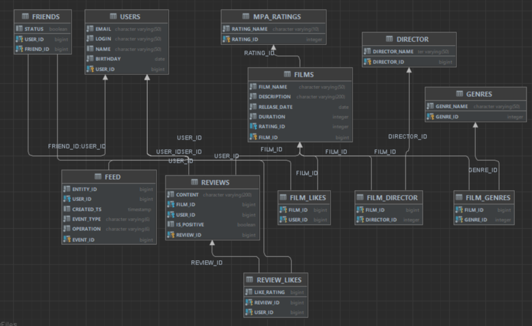

# Групповой проект java-filmorate #группа 5 (Александр Недорезов)

___

## Участники:
* Станислав Иванов **/ тимлид**
* Андрей Козлов
* Анна Есикова
* Антон Горбатенко
* Владимир Нелюбов
* Даниил Кузцецов
* Иван Михайлов

## Функциональность

____

### Режиссеры
В информацию о фильмах добавлен список режиссёров.
#### Добавлена функциональность:
1. Вывод всех фильмов режиссёра, отсортированных по количеству лайков.
2. Вывод всех фильмов режиссёра, отсортированных по годам.
3. Вывод списа всех режиссёров
4. Получение режиссёра по id
5. Создание режиссёра
6. Изменение режиссёра
> За создание функциональности отвечает: Даниил Кузнецов, Станислав Иванов

### Отзывы
В приложении добавлены отзывы на фильмы.
Характеристики отзыва.
1. Оценка — полезно/бесполезно.
2. Тип отзыва — негативный/положительный.
3. Рейтинг (рассчитывается из оценок пользователей), отзывы сортируются по рейтингу
#### Добавлена функциональность:
1. Добавление нового отзыва.
2. Редактирование уже имеющегося отзыва.
3. Удаление уже имеющегося отзыва.
4. Получение отзыва по идентификатору.
5. Получение всех отзывов по идентификатору фильма (если  не указан то все). Если кол-во не указано то 10.
6. Возможность поставить и удалить лайк / дизлайк отзыву.
> За создание функциональности отвечает: Владимир Нелюбов

### Лента событий
Добавлена возможность просмотра последних событий на платформе —
добавление в друзья, удаление из друзей, лайки и отзывы, которые оставили друзья пользователя.
> За создание функциональности отвечает: Станислав Иванов

### Рекомендации
Реализована простая рекомендательную система для фильмов.
> За создание функциональности отвечают: Антон Горбатенко, Андрей Козлов

### Общие фильмы
Реализован вывод общих с другом фильмов с сортировкой по их популярности.
> За создание функциональности отвечает: Анна Есикова

### Удаление фильмов и пользователей
Добавлена функциональность для удаления фильма и пользователя по идентификатору.
> За создание функциональности отвечает: Станислав Иванов

### Вывод самых популярных фильмов по жанру и года
Добавлена возможность выводить топ-N фильмов по количеству лайков с фильтрацией по двум параметрам:
1. По жанру.
2. За указанный год.
> За создание функциональности отвечает: Иван Михайлов

### Поиск
Реализован поиск по названию фильмов и по режиссёру по подстроке
> За создание функциональности отвечает: Даниил Кузнецов

# ER-диаграмма

[Ссылка на диаграмму](src/main/resources/Scheme.png)
